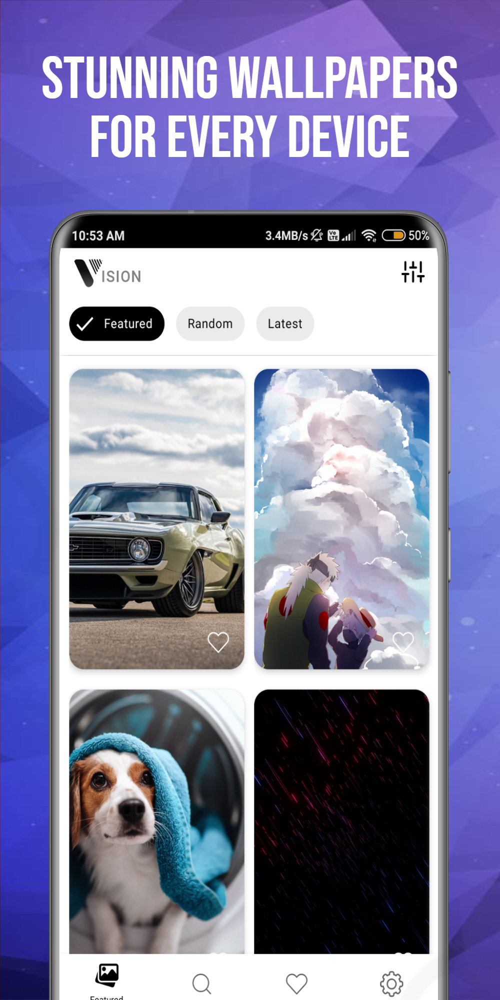
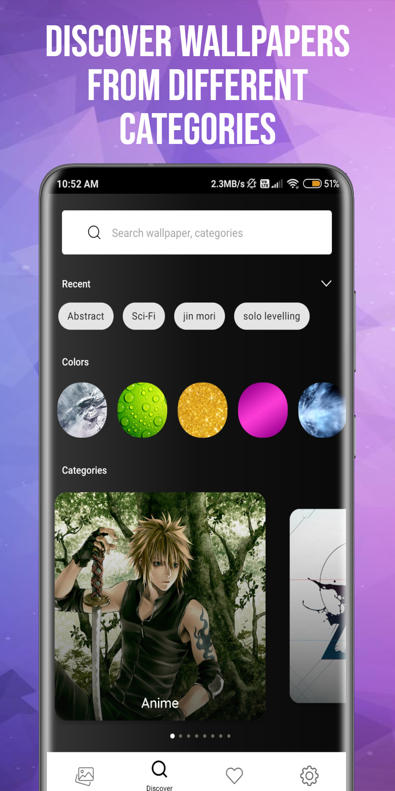
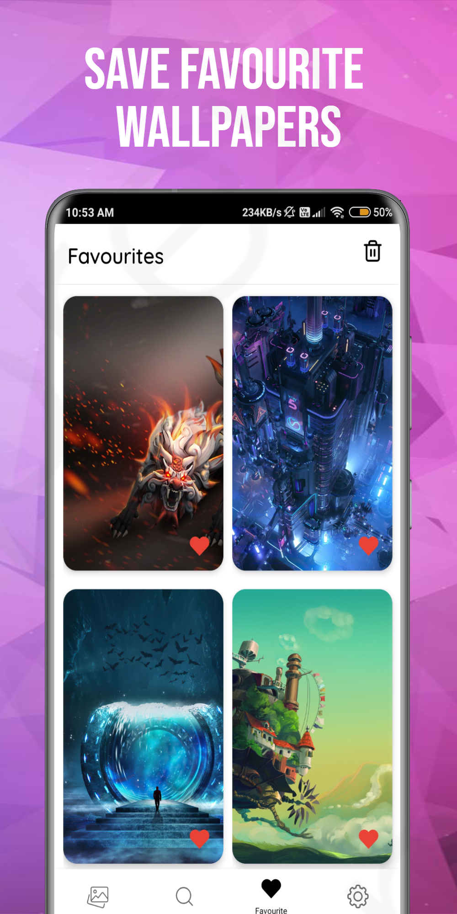
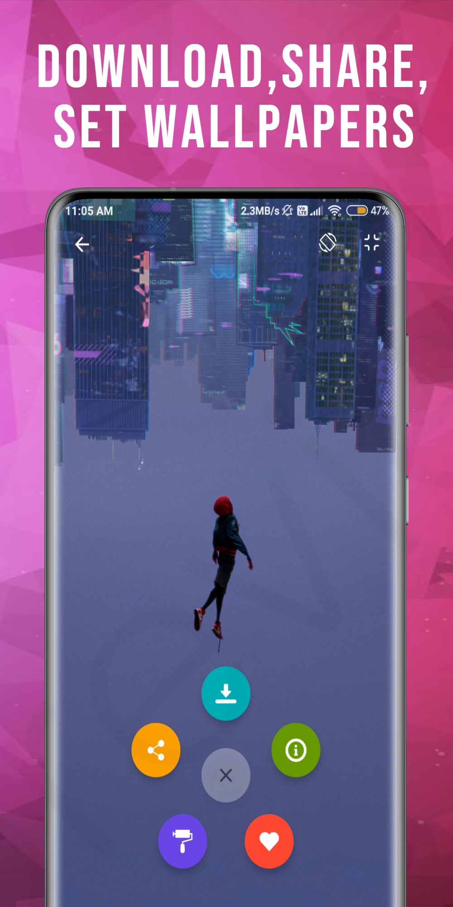
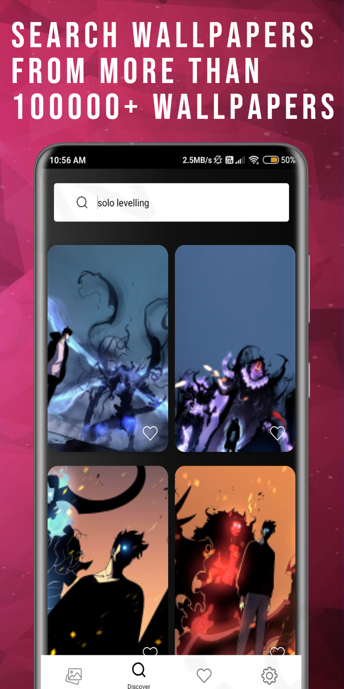

# Vision Wallpapers
A Wallpaper App powered by Wallpaper Abyss' API.

### Preview

  
  

### [Demo Video](https://drive.google.com/file/d/1JVuNiaICMBu9lxqNDkMHBmRqsJQqZxkc/view?usp=drivesdk)

### Tech Stack
* MVVM Architecture
* Retrofit
* Room
* Navigation Component
* kotlin Coroutines
* Glide
* Live data
* View Binding
